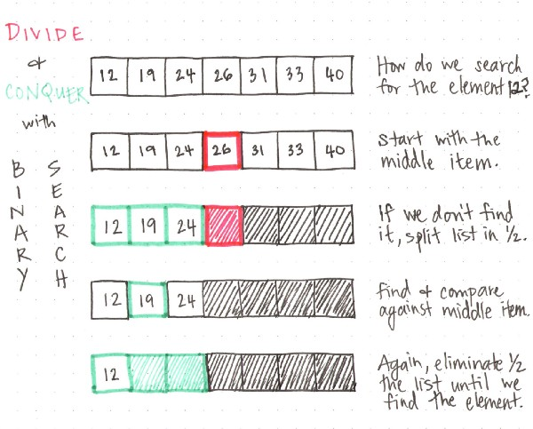

# Binary Search  **Time O(log n)**
> A binary search is an algorithm that simplifies and speeds up searching through a **sorted** collection by dividing the search set into two groups and comparing an element to one that is larger or smaller than the one you’re looking for.

**Procedure**
Given an array A of n elements with values or records A0, A1, ..., An−1, sorted such that A0 ≤ A1 ≤ ... ≤ An−1, and target value T, the following subroutine uses binary search to find the index of T in A.[7]
* Set L to 0 and R to n − 1.
* If L > R, the search terminates as unsuccessful.
* Set m (the position of the middle element) to the floor (the largest previous integer) of (L + R) / 2.
* If Am < T, set L to m + 1 and go to step 2.
* If Am > T, set R to m − 1 and go to step 2.
* Now Am = T, the search is done; return m.


```js
const binarySearch = (arr, element) => {
  let minIndex = 0;
  let maxIndex = arr.length - 1;
  let currentIndex;
  let currentElement;

  while (minIndex <= maxIndex) {
    currentIndex = Math.floor((minIndex + maxIndex) / 2);
    currentElement = arr[currentIndex];

    if (currentElement < element) {
      minIndex = currentIndex + 1;
    } else if (currentElement > element) {
      maxIndex = currentIndex - 1;
    } else {
      return currentIndex;
    }
  }
  return -1;
}
```