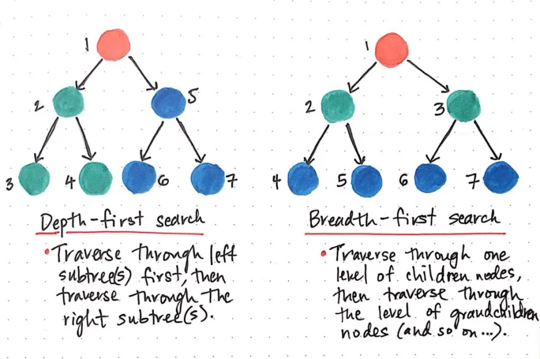
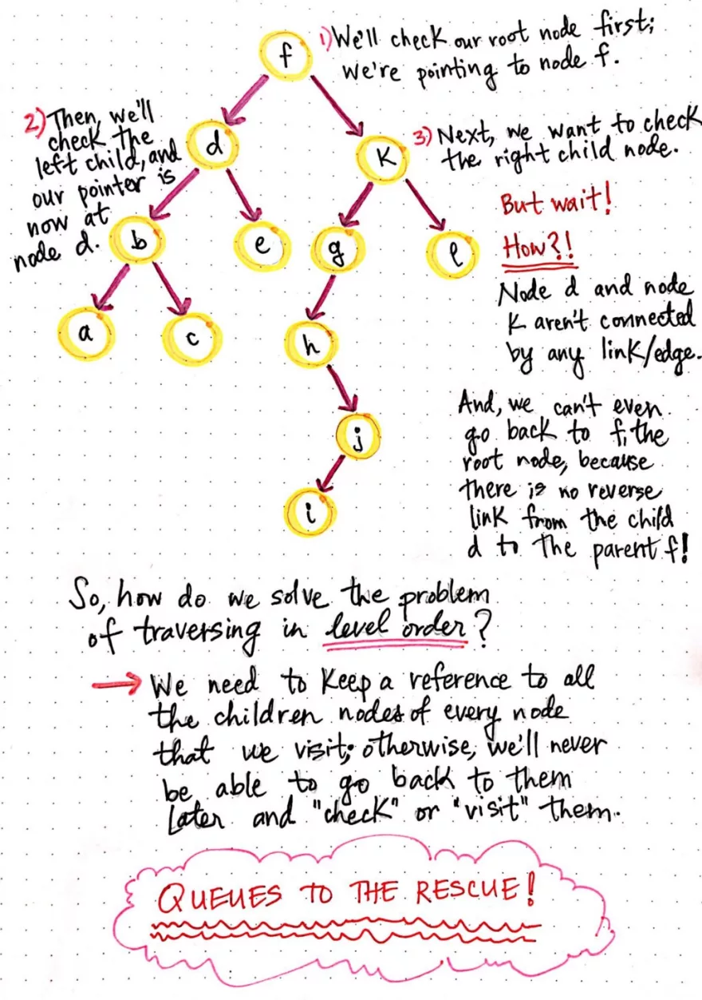
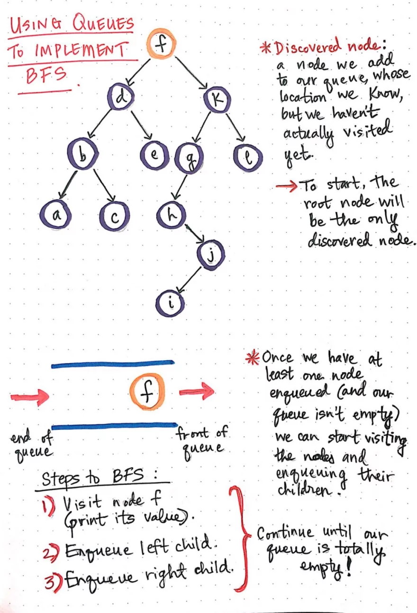
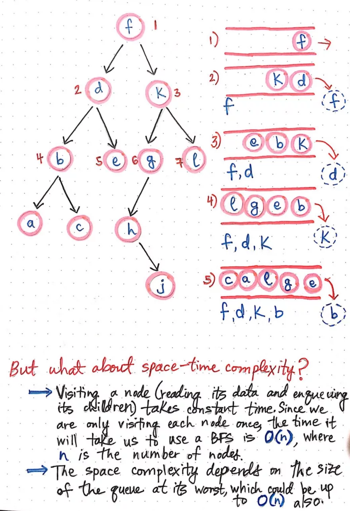

# Breadth First Search ** Time O(n), Space O(n)**

[Link](https://dev.to/vaidehijoshi/breaking-down-breadth-first-search)

Breadth-first search involves search through a tree one level at a time.

We traverse through one entire level of children nodes first, before moving on to traverse through the grandchildren nodes. And we traverse through an entire level of grandchildren nodes before going on to traverse through great-grandchildren nodes.






```js
node1 = {  
 data: 1,  
 left: referenceToLeftNode,  
 right: referenceToRightNode  
};

const levelOrderSearch = (rootNode) => {  
 // Check that a root node exists.  
 if (rootNode === null) {  
   return;  
 }

// Create our queue and push our root node into it.  
 var queue = [];  
 queue.push(rootNode);

  // Continue searching through as queue as long as it's not empty.  
  while (queue.length > 0) {  
    // Create a reference to currentNode, at the top of the queue.  
    var currentNode = queue[0];  

    // If currentNode has a left child node, add it to the queue.  
    if (currentNode.left !== null) {  
      queue.push(currentNode.left);
    }

    // If currentNode has a right child node, add it to the queue.  
    if (currentNode.right !== null) {  
      queue.push(currentNode.right);
    }

    // Remove the currentNode from the queue.  
    queue.shift()  
  }
  // Continue looping through the queue until it's empty!  
}
```