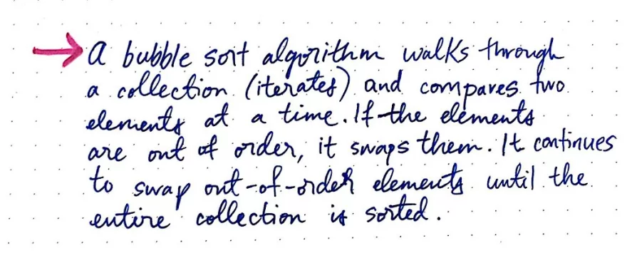
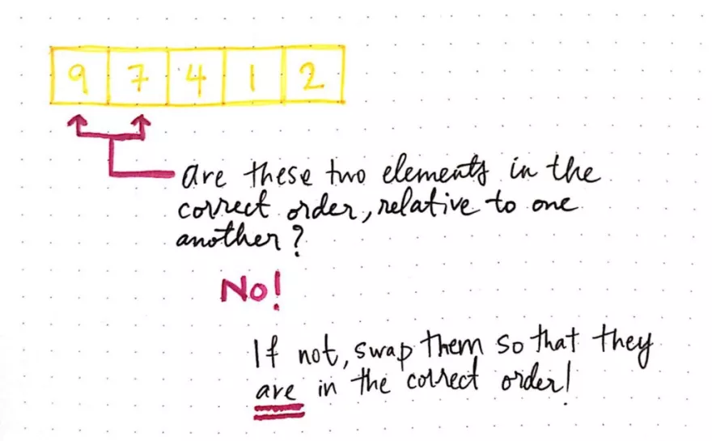
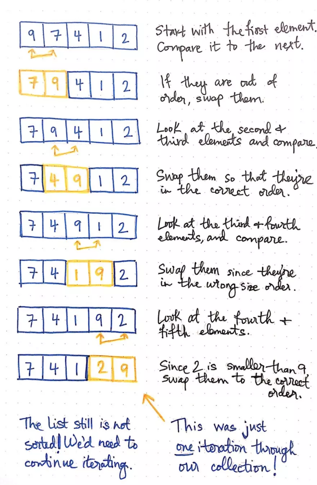
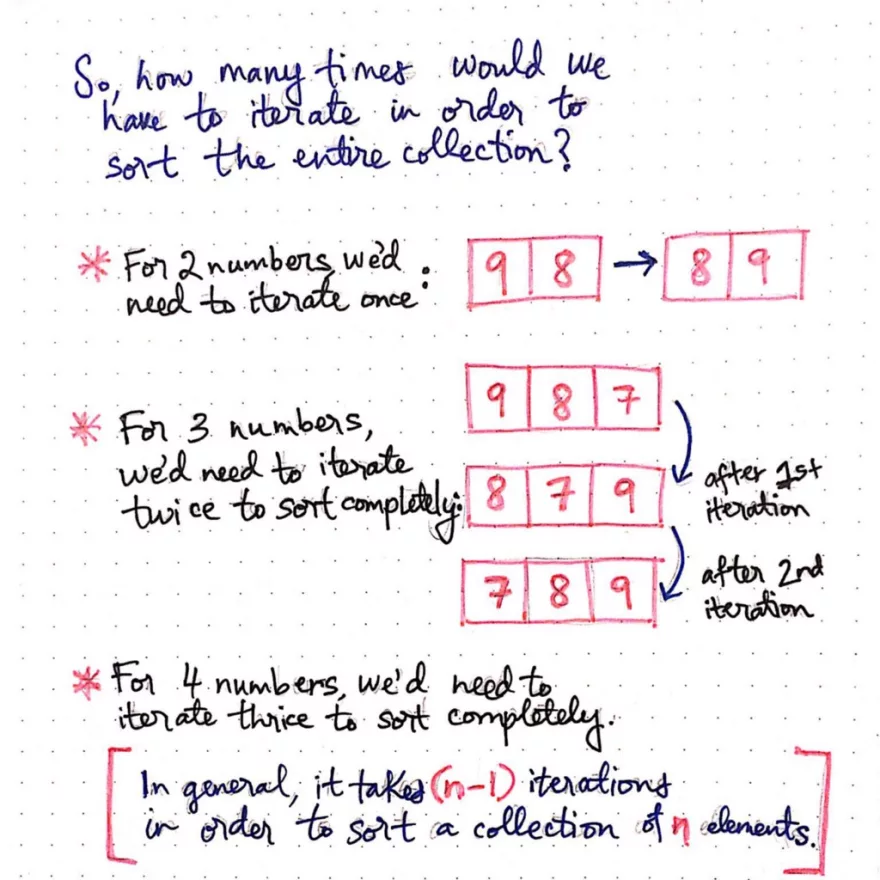
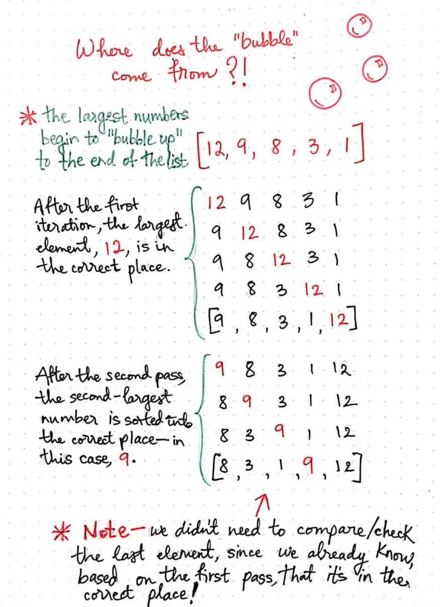
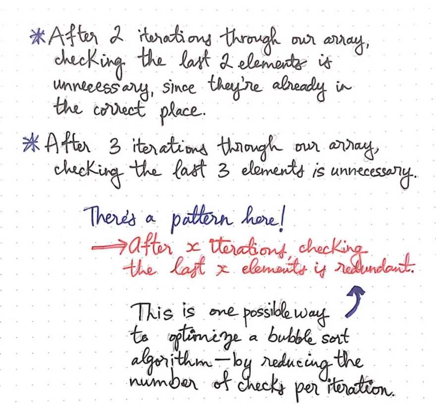
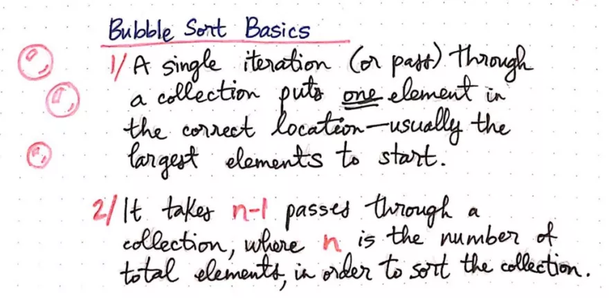
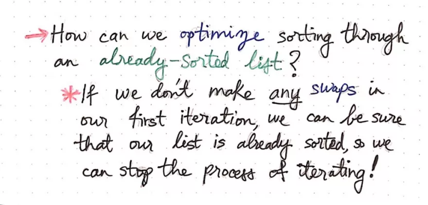
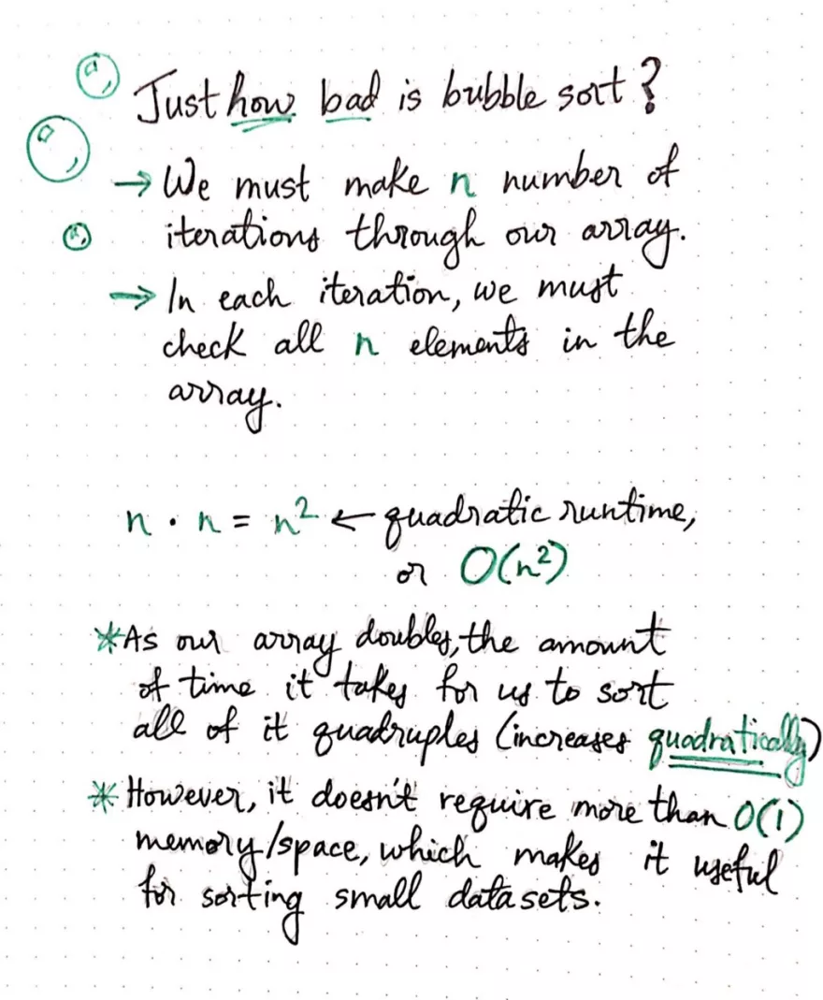
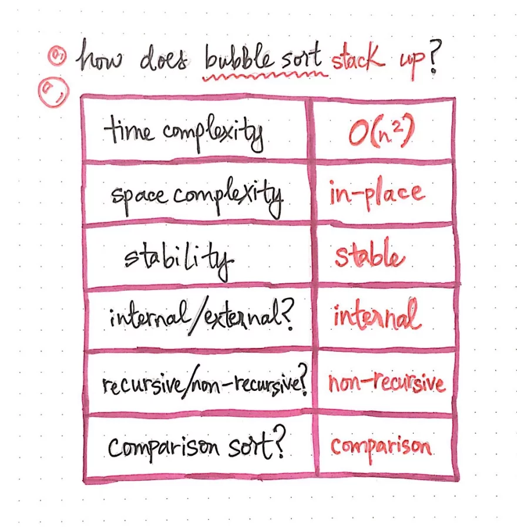

# Bubble Sort

[Link](https://dev.to/vaidehijoshi/bubbling-up-with-bubble-sorts)












```js
const bubbleSort = (array) => {
  let isSorted = false;
  while (!isSorted) {
    // To optimize sort so that we dont iterate over a sorted array already
    // we check if there is no swap in the first iteration and the while loop is exited
    // since the if condition will never be executed in a sorted array
    isSorted = true;

    // Iterate until we get to the last element
    for (let index = 1; index < array.length; index++) {
      // If the element to the left is bigger, then swap the element
      // that we're currently looking at with its left neighbor.
      if (array[index - 1] > array[index]) {
        isSorted = false;
        // Swap elements by creating a temporary reference.
        let temporaryReference = array[index - 1];
        array[index - 1] = array[index];
        array[index] = temporaryReference;
      }
    }
  }
  return array;
}
```