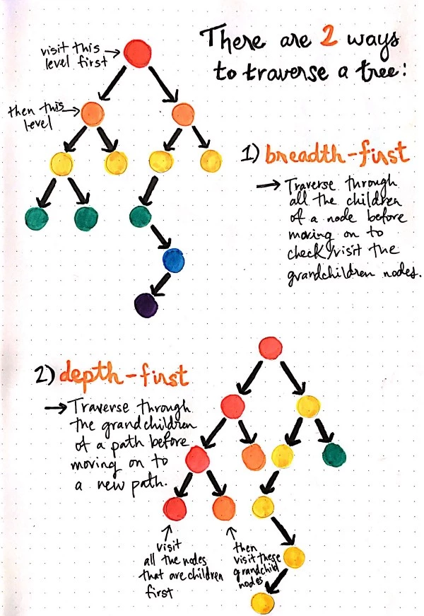
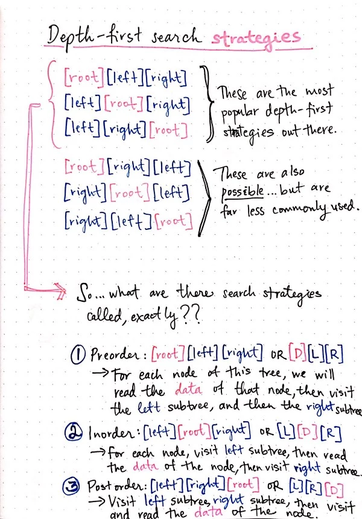
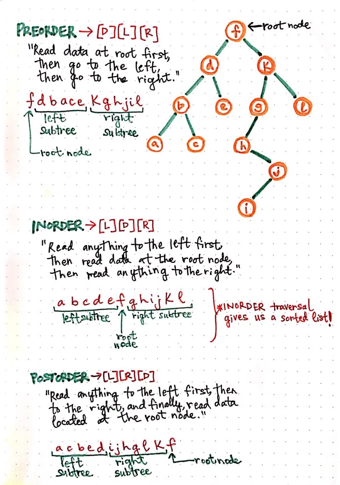
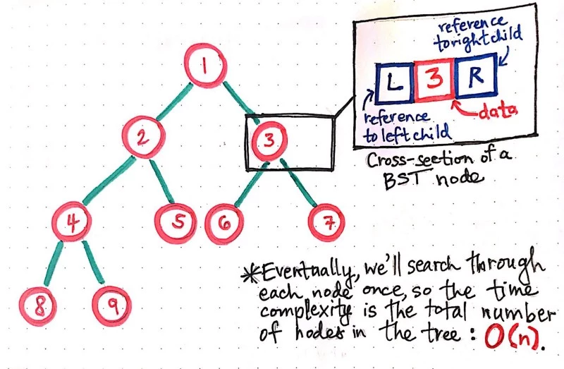
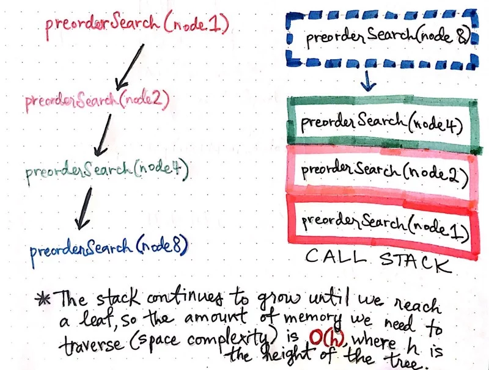
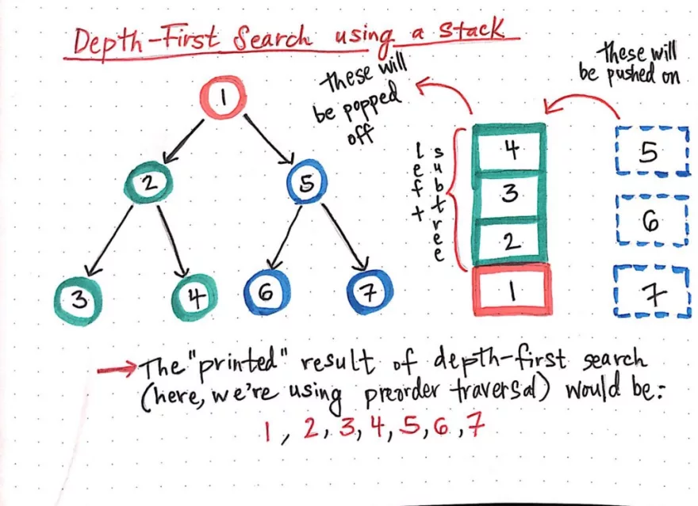

## Depth First Search ** Time O(n), Space O(h == height of tree)**
[Link](https://dev.to/vaidehijoshi/demystifying-depth-first-search)










```js
node1 = {  
  data: 1,  
  left: referenceToLeftNode,  
  right: referenceToRightNode  
};

function preorderSearch(node) {  
  // Check that a node exists.  
  if (node === null) {  
    return;  
  }
  // Print the data of the node.  
  console.log(node.data);  

  // Pass in a reference to the left child node to preorderSearch.  
  // Then, pass reference to the right child node to preorderSearch.  
  preorderSearch(node.left);  
  preorderSearch(node.right);  
}

```