#Hash Table
[Taking Hash Tables off the shelf](https://medium.com/basecs/taking-hash-tables-off-the-shelf-139cbf4752f0)

[Hashing out Hash functions](https://medium.com/basecs/hashing-out-hash-functions-ea5dd8beb4dd)

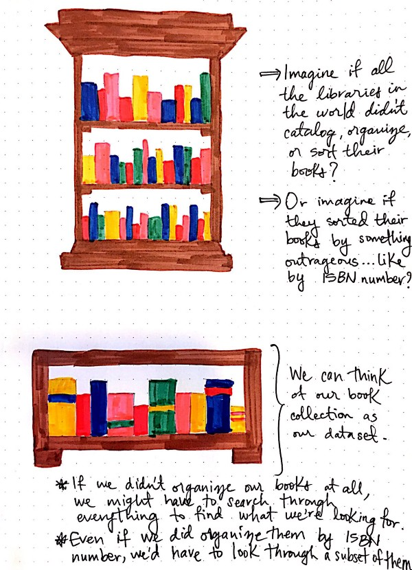
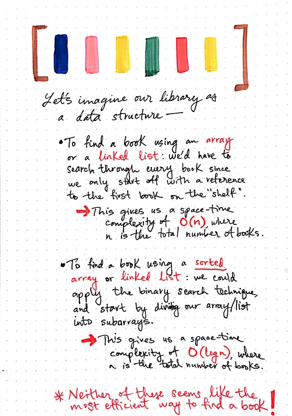
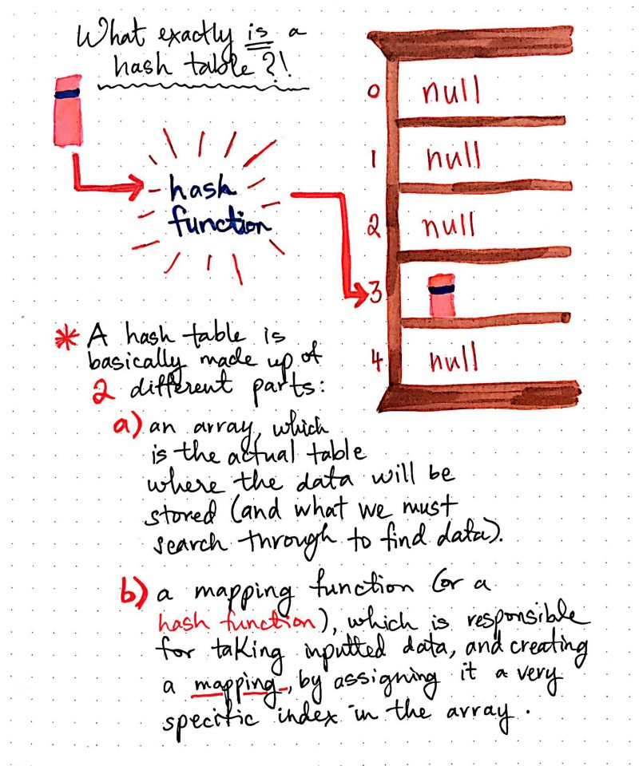
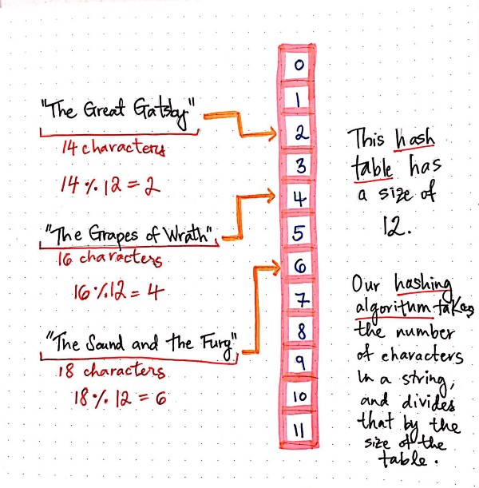
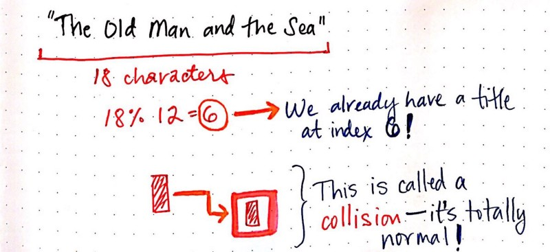
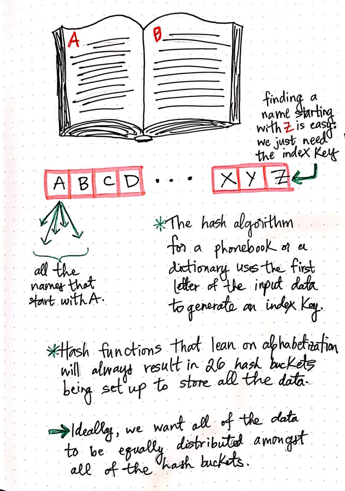
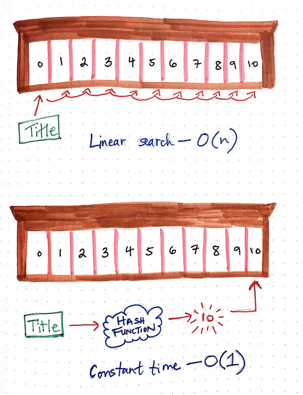

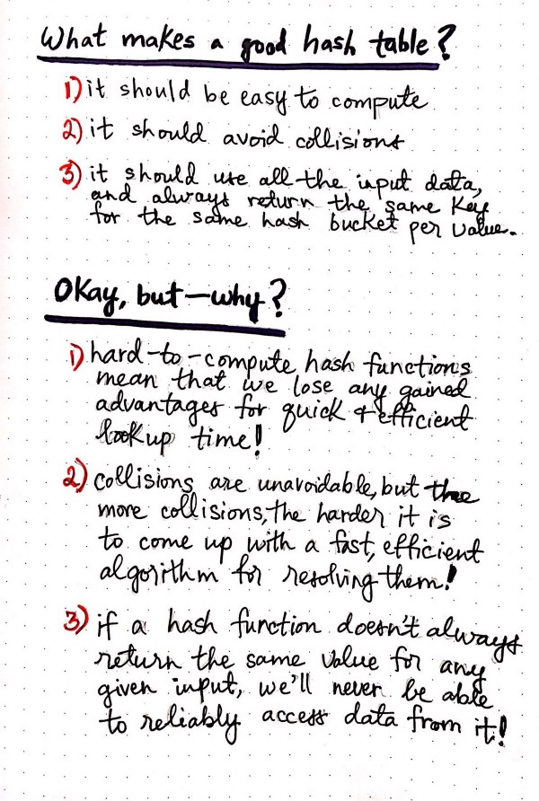
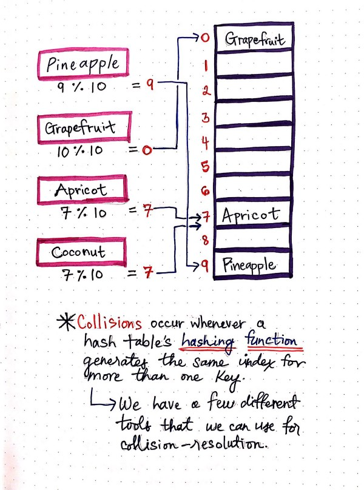
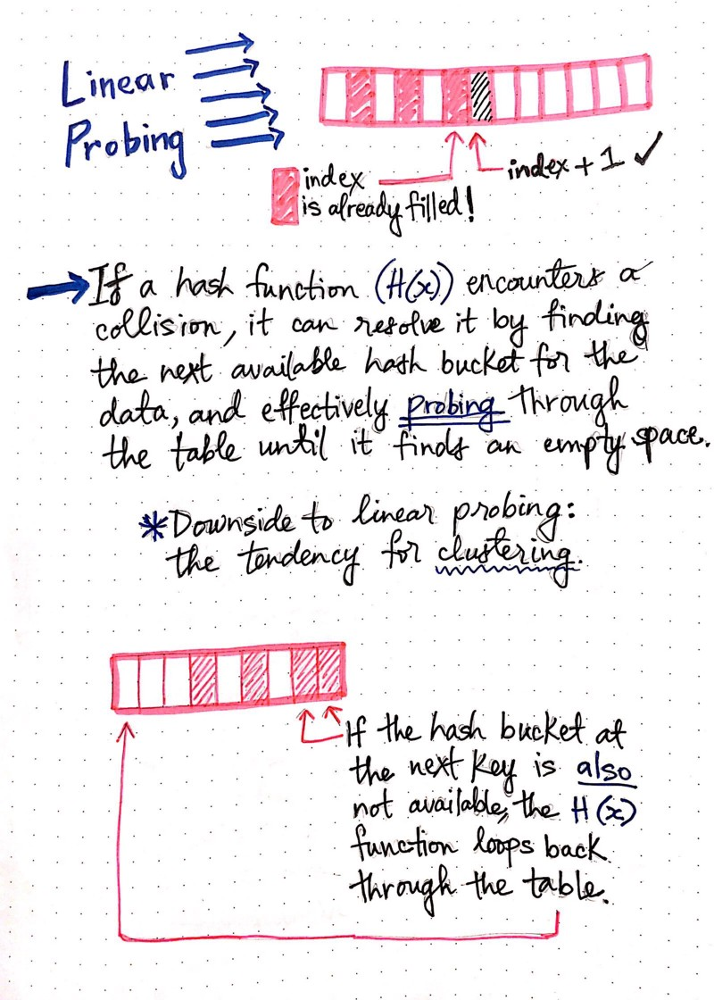
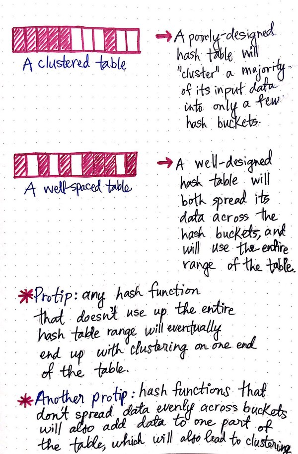
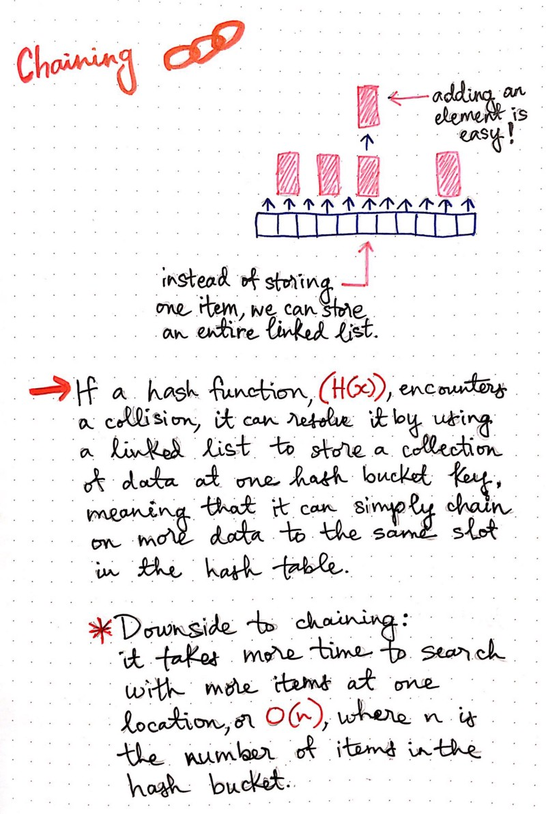
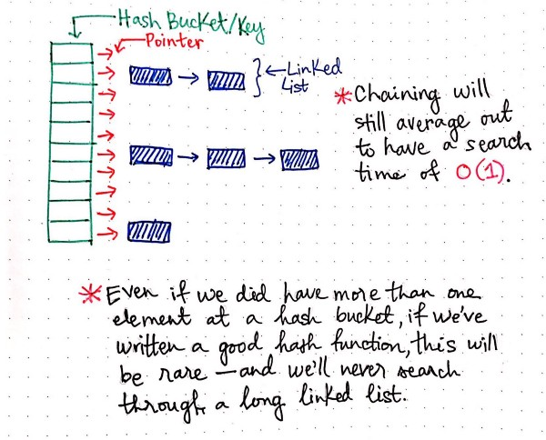
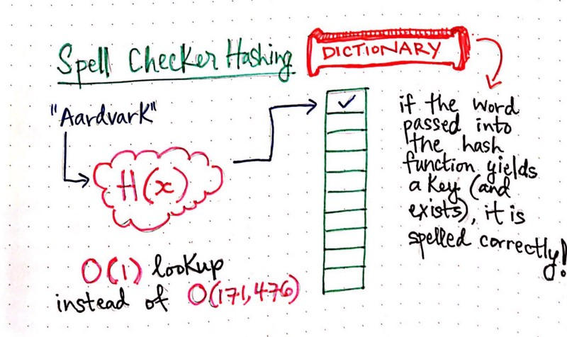
> The problem of storing and retrieving data in O(1) time comes down to answering the above questions. Picking a “good” hash function is key to successfully implementing a hash table. What we mean by “good” is that the function must be easy to compute and avoid collisions as much as possible. If the function is hard to compute, then we lose the advantage gained for lookups in O(1). Even if we pick a very good hash function, we still will have to deal with “some” collisions.
