# Tree
[How to not be stumped by trees](https://medium.com/basecs/how-to-not-be-stumped-by-trees-5f36208f68a7)  
[Leaf It up To Binary Trees](https://medium.com/basecs/leaf-it-up-to-binary-trees-11001aaf746d)
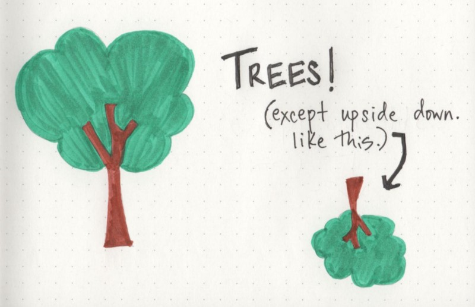
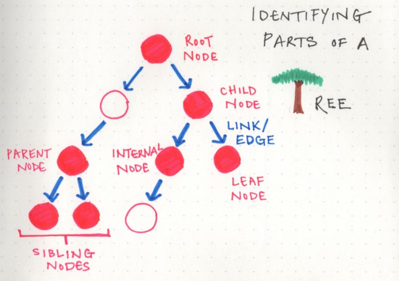

* **Root:** the topmost node of the tree, which never has any links or edges connecting to it
* **Link/Edge:** the reference that a parent node contains that tells it what its child node is
* **Child:** any node that has a parent node that links to it
* **Parent:** any node that has a reference or link to another node
* **Sibling:** any group of nodes that are the children of the same node
* **Internal:** any node that has a child node (basically all parent nodes)
* **Leaf:** any node that does not have a child node in the tree

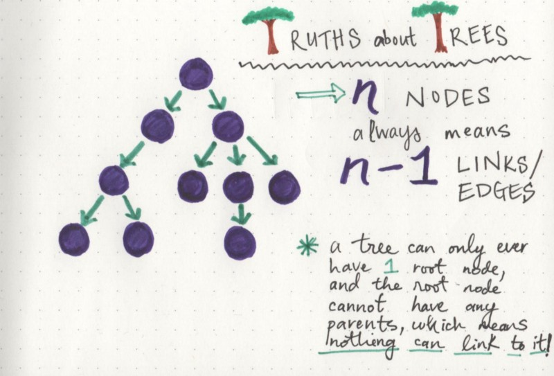
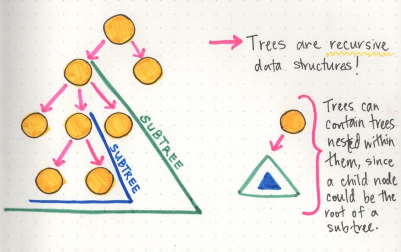
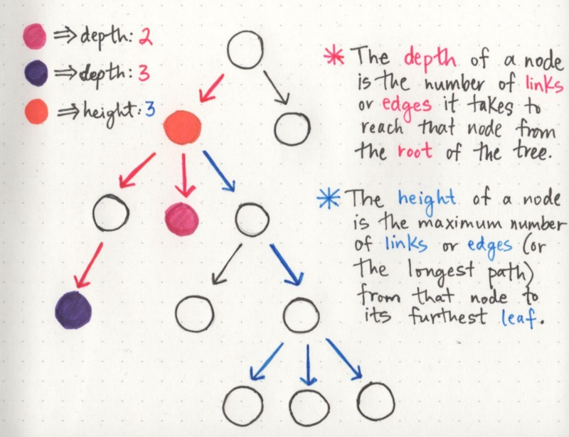
> The cool thing about the height property in particular is that the height of the root node is automatically the height of the entire tree itself. Basically, this means that once we find the leaf node that is the furthest away from the root, we now know the longest possible path in the tree, which tells us how tall it actually is!

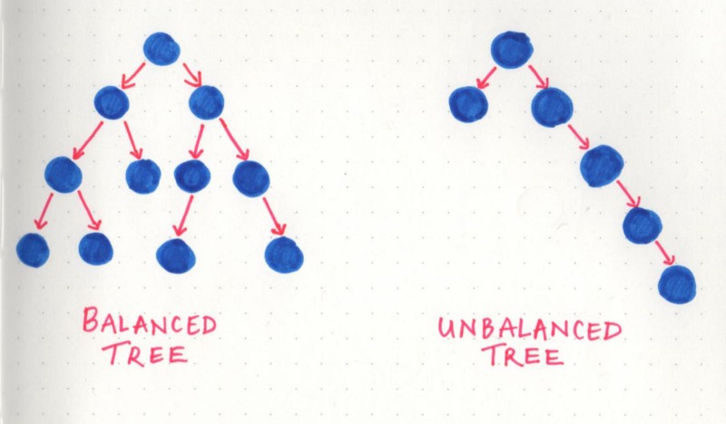

> A tree is considered to be balanced if any two sibling subtrees do not differ in height by more than one level. However, if two sibling subtrees differ significantly in height (and have more than one level of depth of difference), the tree is unbalanced.
A lot of the operational efficiency problems that balanced trees solve are actually called binary trees.

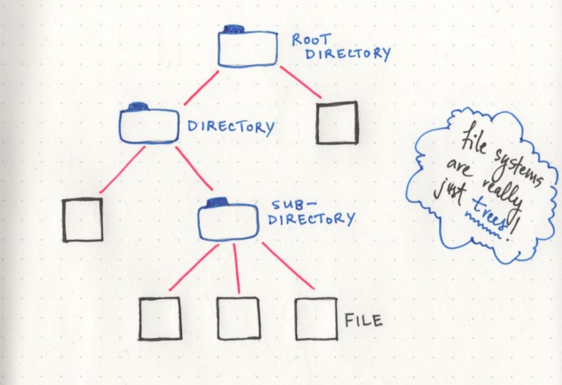

> There are a few different types of tree structures that are used in programming, but the most common (and, arguably, the most powerful) one is a binary search tree.
A binary tree can only ever have two links, connecting to two nodes. This means that every parent node can only ever have two possible child nodes — and never any more than that.

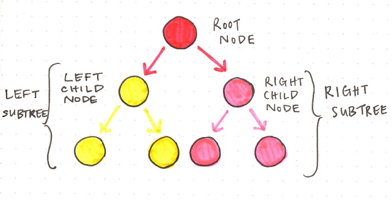

> In order for a BST to be searchable, all of the nodes to the left of the root node must be less than the value of the root node. You might be able to guess, then, that this must mean that all of the values to the right of the root node have to be greater than the root node.

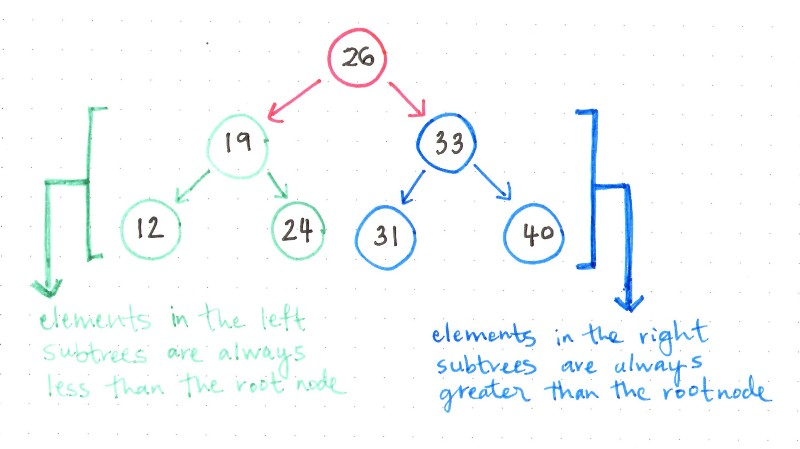

> Any tree can be a binary tree if each node has only two child nodes. It’s the ordering of nodes that makes a binary tree searchable and, by extension, what makes it so powerful.

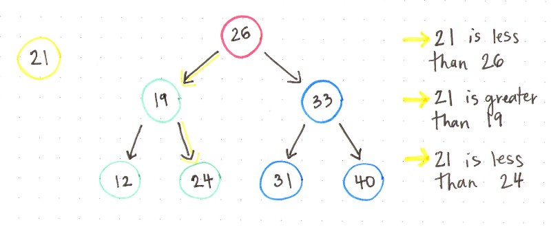
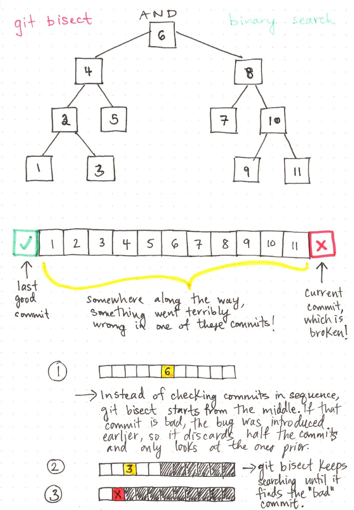
